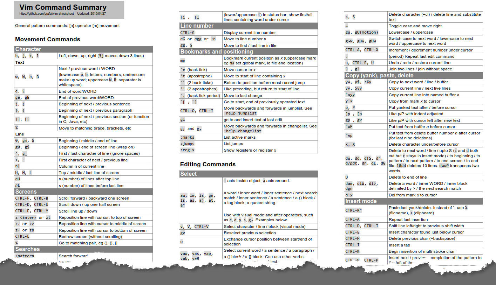

`vim-cheatsheet.pdf` is a summary of common (and some not so common) keyboard commands. I created it when I was learning Vim many years ago. 

The file is two A4 pages, which is one sheet of paper if you print double-sided!

## Background

This cheatsheet is for those who are somewhat familiar with Vim already and acts as a memory aid. The beginner may get confused with the multiple commands I sometimes cram into one line.

You'll probably work out that the cheatsheet evolved organically. When using Vim, if I couldn't remember a command, I'd put it in the cheatsheet. I eventually added some structure. There are, however, some inconsistencies - mainly occurring through my desire to cram stuff in. If you have ideas for improving it, let me know.

There are commands I don't use (eg folding). So, they're not in the cheatsheet. There's only so much you can squeeze onto two sheets.

Vim's comprehensive help has much more info than I could include in the summary. An example lookup in the help is `:h i_ctrl-a`, which tells you more about `CTRL-A` in insert mode. You'll then see other insert mode commands.

Feel free to copy the Word file and amend for your own use. 

## Learning Vim

I'd suggest that you don't try to learn Vim from this cheatsheet but rather use it to remember commands. 

There are many ways to learn Vim. Practice makes perfect or, in the case of Vim, practice makes more familiar. To learn Vim, you could start with the Vim tutor (`:help tutor`). It takes only about 30 minutes. Vim has comprehensive help: `:h user-manual`.
